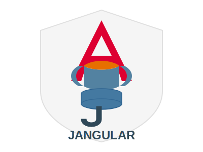

# Jangular

<p align="center">
  
</p>

## Enterprise-Grade Java API & Angular Starter Kit

Jangular is a comprehensive starter kit that combines the power of Spring Boot for backend development and Angular for frontend, with built-in authentication and authorization systems. This project aims to accelerate enterprise-level development by providing a robust foundation for creating secure, scalable applications.

## Features

- **Full-Stack Solution**: Seamlessly integrates Spring Boot backend with Angular frontend
- **Authentication & Authorization**: Pre-configured security using Spring Security and JWT tokens
- **Database Flexibility**: Support for MySQL, PostgreSQL, and MSSQL databases
- **Database Integration**: Database support with JPA/Hibernate
- **Database Migration**: Automated database schema management with Flyway
- **CLI Tool**: Simple command-line interface for project initialization
- **Ready-to-Use Components**: Login, registration, and dashboard components
- **Route Protection**: Built-in authentication guards for securing routes
- **Token Management**: HTTP interceptors for automatic token handling
- **Service Architecture**: Well-structured service layer for API communication

## Technologies

### Backend
- Java 21
- Spring Boot 3.4.3
- Spring Security
- Spring Data JPA
- JWT Authentication
- Flyway Migration
- MySQL, PostgreSQL, or MSSQL support
- Lombok
- Maven

### Frontend
- Angular (latest version)
- TypeScript
- Angular Material
- RxJS
- Lazy-loaded modules
- Route Guards
- HTTP Interceptors
- Reactive Forms

### CLI Tool
- Node.js
- Commander.js
- Inquirer.js
- Chalk
- fs-extra

## Getting Started

### Prerequisites
- Java 21 or higher
- Node.js 16 or higher
- npm or yarn
- MySQL 8.0 or higher, PostgreSQL, or MSSQL
- Maven 3.6 or higher

### Installation

#### Using the Jangular CLI (Recommended)

```bash
# Install the Jangular CLI
npm install jangular-cli

# Create a new Jangular project
npx jangular-cli init my-project

# Navigate to your project
cd my-project

# Start the backend
npm run start:backend

# In another terminal, start the frontend
npm run start:frontend
```

#### Interactive CLI Setup

When initializing a new project, the CLI will prompt you for configuration options:

```
Creating new JAngular project: my-project
✔ Enter base package name: com.example.myproject
✔ Select database type: [MySQL/PostgreSQL/MSSQL]
✔ Enter database name: my_project_db
✔ Enter database username: devuser
✔ Enter database password: ********
```

#### CLI Command Reference

```bash
# View help information
npx jangular-cli --help

# Initialize a new project
npx jangular-cli init <projectName>

# Display version
npx jangular-cli --version
```

#### Manual Installation

1. Clone the repository:
   ```bash
   git clone https://github.com/yourusername/jangular.git
   cd jangular
   ```

2. Configure your database settings in `application.properties` or `application.yml`.

3. Build and run the backend:
   ```bash
   mvn clean install
   mvn spring-boot:run
   ```

4. In a separate terminal, navigate to the frontend directory and run:
   ```bash
   cd frontend
   npm install
   ng serve
   ```

## Project Structure

```
jangular-project/
├── backend/                 # Spring Boot application
│   ├── src/
│   │   ├── main/
│   │   │   ├── java/       # Java source files
│   │   │   ├── resources/  # Backend resources
│   │   │   │   ├── db/migration/  # Flyway migration scripts
│   │   └── test/           # Test files
│   └── pom.xml             # Maven configuration
├── frontend/               # Angular application
│   ├── src/
│   │   ├── app/
│   │   │   ├── auth/       # Authentication module
│   │   │   ├── components/ # UI components
│   │   │   ├── services/   # API services
│   │   │   ├── guards/     # Route guards
│   │   │   └── interceptors/ # HTTP interceptors
│   │   ├── assets/         # Static assets
│   │   └── environments/   # Environment configurations
│   ├── package.json        # NPM dependencies
│   └── angular.json        # Angular CLI configuration
├── package.json            # Root package.json with scripts
└── README.md               # Project documentation
```

## Database Configuration

Jangular supports multiple database systems:

### MySQL Configuration

```yaml
spring:
  datasource:
    url: jdbc:mysql://localhost:3306/your_database_name
    username: your_username
    password: your_password
    driver-class-name: com.mysql.cj.jdbc.Driver
```

### PostgreSQL Configuration

```yaml
spring:
  datasource:
    url: jdbc:postgresql://localhost:5432/your_database_name
    username: your_username
    password: your_password
    driver-class-name: org.postgresql.Driver
```

### MSSQL Configuration

```yaml
spring:
  datasource:
    url: jdbc:sqlserver://localhost:1433;databaseName=your_database_name
    username: your_username
    password: your_password
    driver-class-name: com.microsoft.sqlserver.jdbc.SQLServerDriver
```

## Contributing to Templates

Jangular uses Git submodules for the frontend and backend templates:
- Backend template: `github/nathangtg/jangular-backend`
- Frontend template: `github/nathangtg/frontend`

### How to Contribute

1. **Clone the repository with submodules**:
   ```bash
   git clone --recurse-submodules https://github.com/yourusername/jangular-cli.git
   cd jangular-cli
   ```

2. **Update submodules** (if you didn't clone with `--recurse-submodules`):
   ```bash
   git submodule update --init --recursive
   ```

3. **Making changes to templates**:

   For backend template:
   ```bash
   # Navigate to backend template
   cd templates/backend
   
   # Make your changes
   
   # Commit and push changes
   git add .
   git commit -m "Description of your changes"
   git push origin master
   ```

   For frontend template:
   ```bash
   # Navigate to frontend template
   cd templates/frontend
   
   # Make your changes
   
   # Commit and push changes
   git add .
   git commit -m "Description of your changes"
   git push origin master
   ```

4. **Update the main repository to reference the new template version**:
   ```bash
   # Return to the main project directory
   cd ..
   
   # Update the submodule reference
   git add templates/backend  # or templates/frontend
   git commit -m "Update template reference"
   git push
   ```

## API Endpoints

### Authentication Controller (`/api/auth`)

| Method | Endpoint | Description | Access |
|--------|----------|-------------|--------|
| POST | `/api/auth/login` | User login | Public |
| POST | `/api/auth/register` | User registration | Public |
| POST | `/api/auth/refresh` | Refresh access token | Public |
| POST | `/api/auth/logout` | User logout | Authenticated |

### User Controller (`/api/users`)

| Method | Endpoint | Description | Access |
|--------|----------|-------------|--------|
| GET | `/api/users/me` | Get current user info | Authenticated |
| GET | `/api/users/{id}` | Get user by ID | Admin |
| GET | `/api/users` | Get all users | Admin |
| PUT | `/api/users/{id}` | Update user information | User or Admin |
| POST | `/api/users/{id}/change-password` | Change user password | User or Admin |
| DELETE | `/api/users/{id}` | Soft delete a user | Admin |
| POST | `/api/users/{id}/roles` | Add role to user | Admin |
| DELETE | `/api/users/{id}/roles/{roleName}` | Remove role from user | Admin |
| GET | `/api/users/{id}/login-history` | Get user login history | User or Admin |
| GET | `/api/users/{id}/login-history/range` | Get login history for date range | User or Admin |
| GET | `/api/users/{id}/active-sessions` | Get active sessions | User or Admin |

## Authentication System

### Authentication Flow

1. User registers/logs in through the Angular frontend
2. Backend validates credentials and issues JWT tokens (access and refresh)
3. Tokens are stored securely in the browser's local storage
4. Token interceptor attaches the access token to all subsequent API requests
5. Protected routes check token validity using the auth guard
6. Refresh token functionality automatically renews expired tokens

## Angular Routes Configuration

The following table provides an overview of the application's route structure.

### Main Application Routes

| Path          | Component/Module | Guard(s)     | Description |
|--------------|----------------|-------------|-------------|
| `/auth`      | `AuthModule` (Lazy-loaded) | None | Loads authentication-related routes (Login/Register) |
| `/dashboard` | `DashboardComponent` | `authGuard` | Protected dashboard for authenticated users |
| `/admin/users` | `UserModule` (Lazy-loaded) | `AdminGuard` (Inside `UserModule`) | Admin panel for managing users |
| `/`          | Redirects to `/dashboard` | None | Default redirection |

### User Module Routes (`/admin/users`)

| Path             | Component             | Guard(s)     | Description |
|-----------------|----------------------|-------------|-------------|
| `/admin/users`  | `UserListComponent`   | `AdminGuard` | Displays a list of users |
| `/admin/users/:id` | `UserDetailComponent` | `AdminGuard` | Shows details of a specific user |
| `/admin/users/:id/edit` | `UserDetailComponent` | `AdminGuard` | Edit user details |

The **User Module** is lazily loaded to improve performance, ensuring admin-related routes are only loaded when required.


## Key Services

### Auth Service

```typescript
// Key methods provided by AuthService
login(username: string, password: string): Observable<AuthResponse>
register(user: RegisterRequest): Observable<UserDTO>
refreshToken(refreshToken: string): Observable<AuthResponse>
logout(): void
isAuthenticated(): boolean
getAccessToken(): string
```

### User Service

```typescript
// Key methods provided by UserService
getCurrentUser(): Observable<UserDTO>
getUserById(id: number): Observable<UserDTO>
updateUser(id: number, user: UserDTO): Observable<UserDTO>
changePassword(id: number, oldPassword: string, newPassword: string): Observable<void>
```

## Customization

- Modify authentication providers in Spring Security configuration
- Add custom user roles and permissions
- Extend the database schema for additional user properties
- Customize UI components to match your brand identity
- Add additional Angular modules and components
- Extend authentication with social login providers
- Configure different database providers based on your infrastructure requirements

## Development Workflow

### Backend Development

1. Define entity models in Java classes
2. Create repositories for database operations
3. Implement service layer for business logic
4. Expose REST endpoints through controllers
5. Configure security settings for endpoints

### Frontend Development

1. Create new components using Angular CLI
2. Define services for API communication
3. Set up routes in the appropriate module
4. Implement components with reactive forms
5. Style components according to your design system

## Contributing

Contributions are welcome! Please feel free to submit a Pull Request.

1. Fork the repository
2. Create your feature branch (`git checkout -b feature/amazing-feature`)
3. Commit your changes (`git commit -m 'Add some amazing feature'`)
4. Push to the branch (`git push origin feature/amazing-feature`)
5. Open a Pull Request

## License

This project is licensed under the MIT License - see the LICENSE file for details.

---

**Jangular** - Accelerating Enterprise Application Development