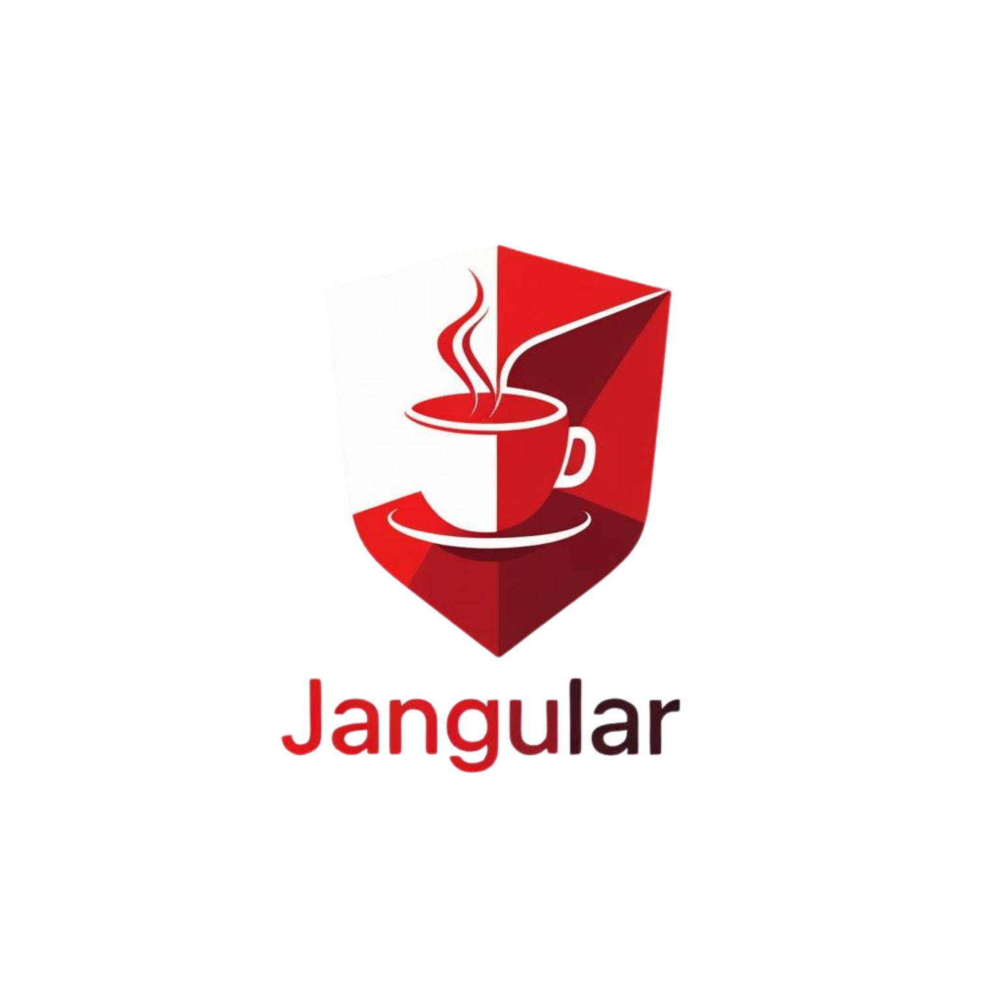

# JAngular CLI

<p align="center">
  
</p>

<p align="center">
  <strong>Enterprise-Grade Full-Stack Development Made Simple</strong>
</p>

<p align="center">
  <a href="https://www.npmjs.com/package/jangular-cli"></a>
  <a href="https://www.npmjs.com/package/jangular-cli"></a>
  <a href="https://github.com/nathangtg/jangular-cli/blob/master/LICENSE.txt"></a>
  <a href="https://nodejs.org"></a>
  <a href="https://www.java.com"></a>
</p>

<p align="center">
  <a href="https://jangular.dev">Documentation</a> •
  <a href="#-features">Features</a> •
  <a href="#-quick-start">Quick Start</a> •
  <a href="#-cli-commands">Commands</a> •
  <a href="#-contributing">Contributing</a>
</p>

---

## Overview

**JAngular CLI** is a powerful command-line interface tool that rapidly bootstraps enterprise-grade full-stack applications combining **Angular 17+** (frontend) and **Spring Boot 3.x** with **Java 21** (backend). Get a production-ready application with authentication, authorization, database integration, and Docker support in minutes.

## ✨ What's New in v2.0.0

- 🎨 **Modern Documentation Site** - Beautiful, responsive documentation built with Next.js
- 🐳 **Enhanced Docker Management** - Interactive Docker service management and monitoring
- 🔐 **Advanced Security Features** - Account lockout, password history, and session management
- 📊 **Improved User Management** - Comprehensive user administration with login history and active sessions
- 🎯 **Better CLI Experience** - Enhanced prompts, validation, and error handling
- 🚀 **Performance Optimizations** - Faster project generation and improved template processing
- 📱 **Responsive UI Components** - Mobile-first Angular components with Tailwind CSS
- 🔄 **Database Migration Improvements** - Enhanced Flyway integration with better schema management

---

## 🚀 Features

### Backend (Spring Boot 3.x + Java 21)

- ✅ **JWT Authentication & Authorization** - Secure token-based authentication with refresh tokens
- ✅ **Multi-Database Support** - MySQL, PostgreSQL, and Microsoft SQL Server
- ✅ **Database Migrations** - Automated schema management with Flyway
- ✅ **Advanced Security** - Spring Security with CSRF protection, account lockout, and password policies
- ✅ **User Management** - Complete CRUD operations with role-based access control
- ✅ **Session Management** - Track and manage active user sessions
- ✅ **Login History** - Comprehensive audit trail of authentication events
- ✅ **RESTful API** - Well-structured endpoints following REST best practices
- ✅ **Exception Handling** - Global error handling with meaningful responses
- ✅ **Validation** - Bean validation for request DTOs
- ✅ **Lombok Integration** - Reduced boilerplate code

### Frontend (Angular 17+)

- ✅ **Standalone Components** - Modern Angular architecture without NgModules
- ✅ **Authentication UI** - Pre-built login, registration, and password reset components
- ✅ **User Dashboard** - Complete user management interface
- ✅ **Route Guards** - Protected routes with authentication guards
- ✅ **HTTP Interceptors** - Automatic token attachment and error handling
- ✅ **Reactive Forms** - Form validation and error handling
- ✅ **Tailwind CSS** - Utility-first styling framework
- ✅ **Responsive Design** - Mobile-first approach
- ✅ **TypeScript** - Type-safe development
- ✅ **Service Architecture** - Organized service layer for API communication

### DevOps & Deployment

- ✅ **Docker Support** - Pre-configured Dockerfiles and docker-compose
- ✅ **Multi-Container Setup** - Database, backend, and frontend containers
- ✅ **Development & Production Profiles** - Environment-specific configurations
- ✅ **Health Checks** - Built-in health monitoring endpoints
- ✅ **Volume Management** - Persistent data storage configuration
- ✅ **Network Isolation** - Secure container networking

### CLI Features

- ✅ **Interactive Setup** - Step-by-step project configuration
- ✅ **System Requirements Check** - Validates dependencies before project creation
- ✅ **Docker Management** - Built-in Docker service management
- ✅ **Progress Indicators** - Real-time feedback during project generation
- ✅ **Validation** - Input validation for all configuration options
- ✅ **Error Handling** - Clear error messages and recovery suggestions

---

## 📋 Technologies

### Backend
- **Java 21** - Latest LTS version with modern features
- **Spring Boot 3.4.3** - Enterprise application framework
- **Spring Security** - Authentication and authorization
- **Spring Data JPA** - Database access and ORM
- **JWT Authentication** - Stateless token-based security
- **Flyway Migration** - Version-controlled database migrations
- **Lombok** - Reduced boilerplate code
- **Maven** - Build automation and dependency management

### Frontend
- **Angular 17+** - Modern web framework with standalone components
- **TypeScript** - Type-safe JavaScript development
- **Tailwind CSS** - Utility-first styling framework
- **RxJS** - Reactive programming
- **Route Guards** - Authentication-based route protection
- **HTTP Interceptors** - Centralized request/response handling
- **Reactive Forms** - Type-safe form management

### CLI Tool
- **Node.js** - JavaScript runtime
- **Commander.js** - Command-line interface framework
- **Inquirer.js** - Interactive command line prompts
- **Chalk** - Terminal string styling
- **Ora** - Elegant terminal spinners
- **fs-extra** - Enhanced file system operations

---

## 📋 Prerequisites

Before using JAngular CLI, ensure you have the following installed:

| Requirement | Version | Description |
|------------|---------|-------------|
| **Node.js** | 18.0.0+ | JavaScript runtime for Angular development |
| **Java** | 21+ | OpenJDK or Oracle JDK for Spring Boot |
| **Maven** | 3.6.0+ | Build automation tool for Java projects |
| **Angular CLI** | 17.0.0+ | Official Angular command line interface |
| **Docker** | Latest | (Optional) For containerized deployment |
| **Git** | Latest | Version control system |

### Installation Check

Verify your system meets the requirements:

```bash
# Check Node.js version
node --version

# Check Java version
java -version

# Check Maven version
mvn -version

# Check Angular CLI version
ng version
```

---

## 🎯 Quick Start

### Install JAngular CLI

```bash
# Install globally via npm
npm install -g jangular-cli

# Verify installation
jangular --version
```

### Create Your First Project

```bash
# Create a new project
jangular init my-awesome-app

# Navigate to your project
cd my-awesome-app

# Install dependencies
npm run install:all

# Start development servers
npm run start:backend    # Terminal 1 - Spring Boot (port 8080)
npm run start:frontend   # Terminal 2 - Angular (port 4200)
```

### Access Your Application

- **Frontend**: http://localhost:4200
- **Backend API**: http://localhost:8080
- **API Documentation**: http://localhost:8080/swagger-ui.html

---

## 📚 CLI Commands

### `jangular init <projectName>`

Initialize a new JAngular project with interactive configuration.

```bash
jangular init my-enterprise-app
```

**Options:**
- `-g, --group-id <groupId>` - Java group ID (default: com.example)
- `-a, --artifact-id <artifactId>` - Java artifact ID (default: backend)

**Interactive Prompts:**
1. Project name confirmation
2. Java package configuration (group ID, artifact ID)
3. Database selection (MySQL, PostgreSQL, MSSQL)
4. Database connection details (host, port, name)
5. Database credentials (username, password)

### `jangular docker`

Manage Docker services for your project with an interactive interface.

```bash
jangular docker
```

**Features:**
- Start/stop all containers
- View service logs in real-time
- Check database connectivity
- Reset volumes and data
- Production mode deployment

### `jangular --test`

Run system requirements check to verify all dependencies are installed.

```bash
jangular --test
```

### `jangular --version`

Display the current version of JAngular CLI.

```bash
jangular --version
```

### `jangular --help`

Display help information and available commands.

```bash
jangular --help
```

---

## 🏗️ Project Structure

```

```
my-awesome-app/
├── backend/                      # Spring Boot Application
│   ├── src/
│   │   ├── main/
│   │   │   ├── java/com/example/app/
│   │   │   │   ├── BackendApplication.java
│   │   │   │   ├── config/          # Configuration classes
│   │   │   │   ├── controller/      # REST controllers
│   │   │   │   ├── dto/             # Data Transfer Objects
│   │   │   │   ├── entity/          # JPA entities
│   │   │   │   ├── repository/      # Spring Data repositories
│   │   │   │   ├── service/         # Business logic
│   │   │   │   ├── security/        # Security configuration
│   │   │   │   └── exception/       # Exception handlers
│   │   │   └── resources/
│   │   │       ├── application.properties
│   │   │       ├── application-mysql.properties
│   │   │       ├── application-postgresql.properties
│   │   │       ├── application-mssql.properties
│   │   │       └── db/migration/    # Flyway migrations
│   │   └── test/                    # Unit and integration tests
│   ├── pom.xml                      # Maven configuration
│   ├── Dockerfile                   # Backend container config
│   └── README.md
│
├── frontend/                        # Angular Application
│   ├── src/
│   │   ├── app/
│   │   │   ├── auth/               # Authentication module
│   │   │   ├── components/         # Reusable components
│   │   │   ├── guards/             # Route guards
│   │   │   ├── interceptors/       # HTTP interceptors
│   │   │   ├── models/             # TypeScript interfaces
│   │   │   ├── services/           # API services
│   │   │   ├── app.component.ts
│   │   │   ├── app.config.ts
│   │   │   └── app.routes.ts
│   │   ├── assets/                 # Static assets
│   │   ├── environments/           # Environment configs
│   │   └── styles.css              # Global styles
│   ├── angular.json                # Angular CLI config
│   ├── package.json
│   ├── tailwind.config.js
│   ├── Dockerfile                  # Frontend container config
│   └── README.md
│
├── docker-compose.yml               # Multi-container orchestration
├── package.json                     # Root project scripts
└── README.md                        # Project documentation
```

---

## 🔐 Authentication Flow

1. **User Registration/Login** - Frontend sends credentials to backend
2. **Token Generation** - Backend validates and issues JWT tokens (access + refresh)
3. **Token Storage** - Tokens stored securely in browser local storage
4. **API Requests** - HTTP interceptor attaches access token to requests
5. **Token Validation** - Backend validates token for protected endpoints
6. **Token Refresh** - Automatic token renewal before expiration
7. **Logout** - Token invalidation and cleanup

---

## 🌐 API Endpoints

### Authentication (`/api/auth`)

| Method | Endpoint | Description | Access |
|--------|----------|-------------|--------|
| POST | `/api/auth/login` | User authentication | Public |
| POST | `/api/auth/register` | New user registration | Public |
| POST | `/api/auth/refresh` | Refresh access token | Public |
| POST | `/api/auth/logout` | User logout | Authenticated |
| POST | `/api/auth/forgot-password` | Initiate password reset | Public |
| POST | `/api/auth/reset-password` | Complete password reset | Public |

### User Management (`/api/users`)

| Method | Endpoint | Description | Access |
|--------|----------|-------------|--------|
| GET | `/api/users` | List all users | Admin |
| GET | `/api/users/{id}` | Get user by ID | User/Admin |
| PUT | `/api/users/{id}` | Update user info | User/Admin |
| DELETE | `/api/users/{id}` | Delete user | Admin |
| POST | `/api/users/{id}/roles` | Assign roles | Admin |
| GET | `/api/users/{id}/sessions` | View active sessions | User/Admin |
| GET | `/api/users/{id}/login-history` | View login history | User/Admin |

### Profile Management (`/api/profile`)

| Method | Endpoint | Description | Access |
|--------|----------|-------------|--------|
| GET | `/api/profile` | Get current user profile | Authenticated |
| PUT | `/api/profile` | Update profile | Authenticated |
| POST | `/api/profile/change-password` | Change password | Authenticated |

---

## 🗄️ Database Configuration

JAngular supports multiple database systems with pre-configured profiles:

### MySQL Configuration

```yaml
spring:
  datasource:
    url: jdbc:mysql://localhost:3306/your_database_name
    username: your_username
    password: your_password
    driver-class-name: com.mysql.cj.jdbc.Driver
```

### PostgreSQL Configuration

```yaml
spring:
  datasource:
    url: jdbc:postgresql://localhost:5432/your_database_name
    username: your_username
    password: your_password
    driver-class-name: org.postgresql.Driver
```

### MSSQL Configuration

```yaml
spring:
  datasource:
    url: jdbc:sqlserver://localhost:1433;databaseName=your_database_name
    username: your_username
    password: your_password
    driver-class-name: com.microsoft.sqlserver.jdbc.SQLServerDriver
```

---

## 🐳 Docker Deployment

### Quick Start with Docker

```bash
# Start all services
docker-compose up -d

# View logs
docker-compose logs -f

# Stop all services
docker-compose down

# Remove volumes (reset data)
docker-compose down -v
```

### Docker Services

- **database** - MySQL/PostgreSQL/MSSQL database
- **backend** - Spring Boot API (port 8080)
- **frontend** - Angular application (port 80)

### Environment Variables

Configure services via environment variables in `docker-compose.yml`:

```yaml
environment:
  - SPRING_PROFILES_ACTIVE=mysql
  - DB_HOST=database
  - DB_PORT=3306
  - DB_NAME=myapp
  - DB_USER=root
  - DB_PASSWORD=root
```

---

## 🛠️ Development

### Backend Development

```bash
cd backend

# Run tests
mvn test

# Build JAR
mvn clean package

# Run with specific profile
mvn spring-boot:run -Dspring-boot.run.profiles=mysql
```

### Frontend Development

```bash
cd frontend

# Install dependencies
npm install

# Start dev server
ng serve

# Build for production
ng build --configuration production

# Run tests
ng test

# Run e2e tests
ng e2e
```

### Available NPM Scripts

```bash
# Root level scripts
npm run install:all        # Install all dependencies
npm run start:backend      # Start Spring Boot
npm run start:frontend     # Start Angular
npm run build:backend      # Build backend JAR
npm run build:frontend     # Build Angular for production
npm run docker:up          # Start Docker containers
npm run docker:down        # Stop Docker containers
```

---

## 🎨 Customization

### Backend Customization

- **Add Custom Entities** - Create new JPA entities in `entity/` package
- **Extend Security** - Modify `SecurityConfig.java` for custom security rules
- **Add Endpoints** - Create new controllers in `controller/` package
- **Custom Validation** - Add validators in `dto/` package
- **Database Migrations** - Add new Flyway scripts in `db/migration/`

### Frontend Customization

- **Add Components** - Generate with `ng generate component <name>`
- **Add Services** - Generate with `ng generate service <name>`
- **Customize Styles** - Modify Tailwind configuration in `tailwind.config.js`
- **Add Routes** - Update `app.routes.ts` with new routes
- **Extend Guards** - Create custom guards for route protection

---

## 📖 Documentation

Comprehensive documentation is available at **[jangular.dev](https://jangular.dev)**

- [Getting Started Guide](https://jangular.dev/getting-started)
- [CLI Commands Reference](https://jangular.dev/commands)
- [Backend Documentation](https://jangular.dev/backend)
- [Frontend Documentation](https://jangular.dev/frontend)
- [Docker Deployment Guide](https://jangular.dev/docker)
- [FAQ](https://jangular.dev/faq)

---

## 🤝 Contributing

We welcome contributions! Please see our [Contributing Guide](CONTRIBUTING.md) for details.

### How to Contribute

1. Fork the repository
2. Create your feature branch (`git checkout -b feature/amazing-feature`)
3. Commit your changes (`git commit -m 'Add some amazing feature'`)
4. Push to the branch (`git push origin feature/amazing-feature`)
5. Open a Pull Request

### Development Setup

```bash
# Clone the repository
git clone https://github.com/nathangtg/jangular-cli.git
cd jangular-cli

# Install dependencies
npm install

# Run in development mode
npm start

# Run tests
npm test
```

---

## 🐛 Bug Reports

Found a bug? Please create an issue on [GitHub Issues](https://github.com/nathangtg/jangular-cli/issues) with:

- Description of the bug
- Steps to reproduce
- Expected behavior
- Actual behavior
- System information (OS, Node.js version, Java version)

---

## 💡 Feature Requests

Have an idea for a new feature? We'd love to hear it! Create a feature request on [GitHub Issues](https://github.com/nathangtg/jangular-cli/issues) with:

- Clear description of the feature
- Use case and benefits
- Any relevant examples or mockups

---

## 📝 Changelog

See [CHANGELOG.md](CHANGELOG.md) for a detailed list of changes in each version.

### v2.0.0 Highlights

- Modern documentation site with Next.js
- Enhanced Docker management interface
- Advanced security features
- Improved user management
- Better CLI experience
- Performance optimizations
- Responsive UI components
- Database migration improvements

---

## 📄 License

This project is licensed under the MIT License - see the [LICENSE.txt](LICENSE.txt) file for details.

---

## 🙏 Acknowledgments

- [Angular](https://angular.io) - Modern web framework
- [Spring Boot](https://spring.io/projects/spring-boot) - Java application framework
- [Spring Security](https://spring.io/projects/spring-security) - Authentication and authorization
- [Flyway](https://flywaydb.org) - Database migration tool
- [Docker](https://www.docker.com) - Containerization platform
- [Tailwind CSS](https://tailwindcss.com) - Utility-first CSS framework

---

## 📞 Support

- 📧 Email: nathan@jangular.dev
- 💬 GitHub Discussions: [Join our community](https://github.com/nathangtg/jangular-cli/discussions)
- 🐛 Issues: [Report bugs](https://github.com/nathangtg/jangular-cli/issues)
- 📚 Documentation: [jangular.dev](https://jangular.dev)

---

## ⭐ Show Your Support

If you find JAngular CLI helpful, please consider:

- ⭐ Starring the repository on [GitHub](https://github.com/nathangtg/jangular-cli)
- 🐦 Sharing on social media
- 📝 Writing a blog post or tutorial
- 💬 Spreading the word to other developers

---
<p align="center">
  <sub>JAngular CLI - Enterprise Application Development Simplified</sub>
</p>
